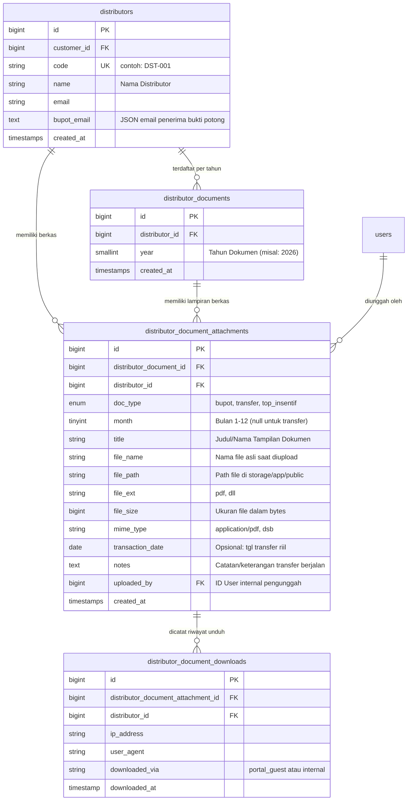

# 📘 Analisis & Spesifikasi Implementasi Sistem Upload Dokumen Distributor

Dokumen ini berisi spesifikasi kebutuhan fungsional, alur pengguna (*User Flow*), rancangan antarmuka (*UI/UX Design*), rekomendasi skema basis data (*Database Schema*), serta arsitektur kode untuk fitur **Pengelolaan Dokumen Distributor (Bukti Potong, Penjelasan Transfer, dan TOP Insentif)** di sistem Finance.

---

## 📑 Daftar Isi
1. [Latar Belakang & Analisis Kebutuhan](#1-latar-belakang--analisis-kebutuhan)
2. [Klasifikasi & Karakteristik Tipe Dokumen](#2-klasifikasi--karakteristik-tipe-dokumen)
3. [Arsitektur Alur Pengguna (User Flow)](#3-arsitektur-alur-pengguna-user-flow)
   - [A. Sisi Internal Finance (Upload & Matrix 12 Bulan + Tab Transfer Running)](#a-sisi-internal-finance-upload--matrix-12-bulan--tab-transfer-running)
   - [B. Sisi Eksternal Distributor (Portal Dokumen Mandiri di Halaman Login)](#b-sisi-eksternal-distributor-portal-dokumen-mandiri-di-halaman-login)
4. [Rancangan Desain Antarmuka (UI/UX Mockup)](#4-rancangan-desain-antarmuka-uiux-mockup)
5. [Rekomendasi Skema Database (Database Design & Migrations)](#5-rekomendasi-skema-database-database-design--migrations)
6. [Rekomendasi Model Eloquent & Relasi Laravel](#6-rekomendasi-model-eloquent--relasi-laravel)
7. [Rancangan Routing & Controller](#7-rancangan-routing--controller)
8. [Keamanan & Audit Trail (Security & Compliance)](#8-keamanan--audit-trail-security--compliance)

---

## 1. Latar Belakang & Analisis Kebutuhan

Sistem ini melayani dua peran pengguna (*Dual Actors*):
1. **Tim Internal Finance / Tax / Sales Admin:**
   * Memantau kelengkapan dokumen pajak bulanan dan insentif seluruh distributor per tahun berjalan (Januari s/d Desember).
   * Mengunggah (*upload drag-and-drop* / *picker*), pratinjau (*preview*), serta menghapus/memperbaiki dokumen.
   * Mengelola berkas **Penjelasan Transfer** yang bersifat *running terus menerus* (sejak tahun-tahun terdahulu, misal dari tahun 2020 sampai sekarang) tanpa dibatasi oleh siklus tahunan.
2. **Distributor (Akses Mandiri / Self-Service):**
   * Mengakses portal dokumen langsung dari halaman login utama melalui tab khusus **"Portal Dokumen Distributor"**.
   * Tidak memerlukan akun login karyawan (NIK & Password), cukup memasukkan **Kode Distributor** dan memilih **Tahun**.
   * Mengunduh Bukti Potong Pajak per tahun, serta melihat seluruh riwayat Penjelasan Transfer yang pernah diterima.

---

## 2. Klasifikasi & Karakteristik Tipe Dokumen

Terdapat perbedaan mendasar antara dokumen **siklus kalender tahunan** versus dokumen **berjalan sepanjang masa kerjasama (*lifetime / multi-year running*)**:

| Tipe Dokumen | Lingkup (*Scope*) | Batasan Jumlah (*Cardinality*) | Karakteristik Bisnis & Penanganan Sistem |
| :--- | :---: | :---: | :--- |
| **Bukti Potong (BuPot)** | **Per Tahun & Per Bulan (Jan - Des)** | Multi-file (> 1 file per bulan) | Terikat masa pajak bulanan (Januari s/d Desember pada tahun yang dipilih). Distributor bisa memiliki beberapa bukti potong per masa (PPh 23, PPh 22, atau revisi/pembetulan). |
| **TOP Insentif** | **Per Tahun & Per Bulan (Jan - Des)** | Multi-file (> 1 file per bulan/periode) | Terikat periode tahun berjalan. Berisi memo persetujuan insentif, perhitungan target sales, atau persetujuan deviasi TOP per bulan/kuartal. |
| **Penjelasan Transfer** | **Per Distributor (Running Multi-Year / Sejak 2020 s/d Sekarang)** | Multi-file (Running terus tanpa batas tahun) | **TIDAK TERIKAT per tahun/bulan kalender.** Menjadi *repository* riwayat dokumen transfer distributor dari tahun-tahun terdahulu (misal: arsip sejak 2020) hingga transaksi transfer terkini. Selalu tampil utuh tanpa terpotong filter tahun aktif. |

---

## 3. Arsitektur Alur Pengguna (User Flow)

```mermaid
graph TD
    subgraph A["Sisi Internal (Finance Portal)"]
        A1[Menu: Dokumen Distributor] --> A2[Filter Tahun Aktif: misal 2026]
        A2 --> A3[Tabel List Distributor + Mini Badge Status Jan-Des + Badge Total Trf Running]
        A3 -->|Klik Baris / Kelola File| A4[Halaman Detail Distributor]
        A4 --> A5{Pilih Tab Navigasi}
        A5 -->|Tab 1: Dokumen Bulanan| A6[Matrix 12 Bulan Jan-Des: BuPot & TOP Insentif]
        A6 --> A7[Drop/Upload File Bulanan + Preview + Hapus]
        A5 -->|Tab 2: Penjelasan Transfer| A8[Timeline Running Transfer: Berkas dari 2020 s/d Sekarang]
        A8 --> A9[Upload Transfer Baru Kapan Saja + Catatan Transaksi]
    end

    subgraph B["Sisi Eksternal (Halaman Login -> Tab BuPot)"]
        B1[Buka Halaman Login /login] --> B2[Klik Tab: Portal Dokumen Distributor]
        B2 --> B3[Input: Kode Distributor + Tahun]
        B3 --> B4{Validasi Cocok?}
        B4 -->|Tidak| B5[Tampilkan Pesan Error: Kode Distributor Tidak Ditemukan]
        B4 -->|Ya| B6[Buka Dashboard Dokumen Distributor]
        B6 --> B7{Pilihan Navigasi}
        B7 -->|Tab 1: BuPot & TOP| B8[Pilih Tahun: Download/Preview BuPot & Insentif Jan-Des]
        B7 -->|Tab 2: Penjelasan Transfer| B9[Lihat Seluruh Riwayat Transfer Running Sejak 2020]
        B6 --> B10[Download Paket All .ZIP]
    end
```



---

## 4. Rancangan Desain Antarmuka (UI/UX Mockup)

### A. Tampilan List Index Distributor (Finance Admin)
Menggunakan **Smart Data Table** dengan visualisasi status 12 bulan (BuPot & TOP) serta badge jumlah berkas Transfer running:

```text
========================================================================================================
📋 MANAJEMEN DOKUMEN DISTRIBUTOR                              [ Filter Tahun: 2026 v ] [ + Upload Massal ]
========================================================================================================
Pencarian: [ Cari nama/kode distributor... ]
--------------------------------------------------------------------------------------------------------
KODE     | NAMA DISTRIBUTOR        | PROGRES BULANAN 2026 (JAN - DES)        | TRF RUNNING | AKSI
--------------------------------------------------------------------------------------------------------
DST-001  | PT Sinar Abadi Jaya     | [1][2][3][4][5][6][7][8][9][10][11][12] | 8 File      | [ 📂 Kelola File ]
         |                         |  🟩 🟩 🟩 🟩 🟨 ⬜ ⬜ ⬜ ⬜  ⬜  ⬜  ⬜   | (2020-2026) |
DST-002  | CV Maju Bersama         |  🟩 🟩 ⬜ ⬜ ⬜ ⬜ ⬜ ⬜ ⬜  ⬜  ⬜  ⬜   | 3 File      | [ 📂 Kelola File ]
DST-003  | PT Cahaya Distribusi    |  ⬜ ⬜ ⬜ ⬜ ⬜ ⬜ ⬜ ⬜ ⬜  ⬜  ⬜  ⬜   | 0 File      | [ 📂 Kelola File ]
--------------------------------------------------------------------------------------------------------
Keterangan Badge: 🟩 Lengkap (BuPot & TOP ada) | 🟨 Sebagian terisi | ⬜ Kosong (Belum ada dokumen)
```

---

### B. Tampilan Halaman Detail Distributor (Pemisahan Tab: Bulanan vs Transfer Running)
Halaman detail distributor dibagi menjadi 2 Tab Utama yang jelas:

```text
+----------------------------------------------------------------------------------------------------+
| 🏢 PT Sinar Abadi Jaya (DST-001)                                              [ 💾 Download All .ZIP ]
| NPWP: 01.234.567.8-901.000 | Email: finance@sinarabadi.co.id
+----------------------------------------------------------------------------------------------------+
|  [ TAB 1: Dokumen Bulanan (BuPot & TOP Insentif) ]  |  [ TAB 2: Penjelasan Transfer (Running) ]    |
+----------------------------------------------------------------------------------------------------+

=== JIKA MEMILIH TAB 1: DOKUMEN BULANAN ===
Filter Tahun: [ 2026 v ]

[ 📅 JANUARI 2026 ] 🟩 3 Dokumen                     [ 📅 FEBRUARI 2026 ] 🟨 1 Dokumen
+--------------------------------------------------+ +--------------------------------------------------+
| 🧾 Bukti Potong (2 File):                        | | 🧾 Bukti Potong (1 File):                        |
|   • Bupot_PPh23_Jan.pdf  (420 KB)                | |   • Bupot_PPh23_Feb.pdf (380 KB)                 |
|     [ 👁️ Preview ] [ ⬇️ Download ] [ 🗑️ Hapus ]     |     [ 👁️ Preview ] [ ⬇️ Download ] [ 🗑️ Hapus ]     |
|   • Bupot_PPN_Jan.pdf    (310 KB)                | |   [ + Tambah BuPot ]                             |
|     [ 👁️ Preview ] [ ⬇️ Download ] [ 🗑️ Hapus ]     | |                                                  |
|   [ + Tambah BuPot ]                             | | 🎯 TOP Insentif (0 File):                        |
|                                                  | |   +--------------------------------------------+ |
| 🎯 TOP Insentif (1 File):                        | |   | ☁️ Drag & drop file TOP Insentif Feb di sini| |
|   • Memo_Insentif_Jan.pdf [ 👁️ ] [ ⬇️ ] [ 🗑️ ]     | |   +--------------------------------------------+ |
|   [ + Tambah TOP Insentif ]                      | |                                                  |
+--------------------------------------------------+ +--------------------------------------------------+
| ... [ MARET s/d DESEMBER 2026 ]                  |                                                    |
+--------------------------------------------------+----------------------------------------------------+

=== JIKA MEMILIH TAB 2: PENJELASAN TRANSFER (RUNNING LINTAS TAHUN) ===
Daftar seluruh dokumen penjelasan transfer distributor ini (dari 2020 hingga sekarang):

[ + Upload File Transfer Baru ]  [ Pencarian / Filter Tahun: Semua Tahun v ]

--------------------------------------------------------------------------------------------------------
TGL / TAHUN  | NAMA FILE                  | KETERANGAN / CATATAN                   | UKURAN | AKSI
--------------------------------------------------------------------------------------------------------
15 Jan 2026  | Trf_Pelunasan_Jan2026.pdf  | Transfer pelunasan invoice INV-2026-01 | 350 KB | [👁️] [⬇️] [🗑️]
10 Nov 2025  | Rekap_Trf_Q4_2025.xlsx     | Rekonsiliasi transfer kuartal 4       | 1.2 MB | [👁️] [⬇️] [🗑️]
05 Mar 2023  | Penjelasan_Transfer_2023.pdf| Bukti transfer kompensasi retur       | 280 KB | [👁️] [⬇️] [🗑️]
12 Agu 2020  | Arsip_Trf_Awal_2020.pdf    | Dokumen transfer awal kerja sama      | 520 KB | [👁️] [⬇️] [🗑️]
--------------------------------------------------------------------------------------------------------
```

---

### C. Tampilan Tab Halaman Login (Publik untuk Distributor)
Distributor mengakses dokumen tanpa login internal karyawan:

```text
+---------------------------------------------------------------------------------+
|                           CUSTOMER PORTAL FINANCE                               |
+---------------------------------------------------------------------------------+
|  [ 👤 Login Karyawan (NIK) ]    |    [ 📜 Portal Dokumen Distributor (BuPot) ]  | <-- Aktif
+---------------------------------------------------------------------------------+
| Akses Mandiri Dokumen Pajak, Transfer & Insentif Distributor                   |
|                                                                                 |
| Kode Distributor *                                                              |
| [ DST-001                                                          ]            |
|                                                                                 |
| Tahun Dokumen / Pajak *                                                         |
| [ 2026                                                           v ]            |
|                                                                                 |
| [ 🔍 Akses Dokumen Saya ]                                                       |
+---------------------------------------------------------------------------------+

(Setelah Tombol Diklik dan Validasi Lolos - Tampil 2 Tab Navigasi Dokumen):
+---------------------------------------------------------------------------------+
| PT Sinar Abadi Jaya (DST-001)                          [ 📦 Download Semua ZIP ]|
|                                                                                 |
|  [ 🧾 Bukti Potong & TOP (Per Tahun) ]  |  [ 💸 Penjelasan Transfer (Running) ] |
|                                                                                 |
|  (Jika Tab 1 Aktif - Pilih Tahun: [ 2026 v ])                                   |
|   • Januari 2026:                                                               |
|     - Bukti Potong PPh 23 - Jan 2026.pdf (420 KB)    [ 👁️ Preview ] [ ⬇️ Unduh ]|
|     - Bukti Potong PPN - Jan 2026.pdf (310 KB)       [ 👁️ Preview ] [ ⬇️ Unduh ]|
|     - TOP Insentif Jan 2026.pdf (180 KB)             [ 👁️ Preview ] [ ⬇️ Unduh ]|
|                                                                                 |
|  (Jika Tab 2 Aktif - Menampilkan Semua Dokumen Transfer dari 2020 s/d Sekarang):|
|   • [2026] Transfer Pelunasan Jan 2026.pdf (350 KB)  [ 👁️ Preview ] [ ⬇️ Unduh ]|
|   • [2025] Rekap Transfer Q4 2025.xlsx (1.2 MB)      [ ⬇️ Unduh ]               |
|   • [2023] Penjelasan Transfer 2023.pdf (280 KB)     [ 👁️ Preview ] [ ⬇️ Unduh ]|
|   • [2020] Arsip Transfer Awal 2020.pdf (520 KB)     [ 👁️ Preview ] [ ⬇️ Unduh ]|
+---------------------------------------------------------------------------------+
```

---

## 5. Rekomendasi Skema Database (Database Design & Migrations)

### Diagram Relasi Entitas (ERD)



---

### Migration 1: `create_distributor_documents_table.php` (Header Pendaftaran per Tahun)

```php
Schema::create('distributor_documents', function (Blueprint $table) {
    $table->id();
    $table->foreignId('distributor_id')->constrained('distributors')->cascadeOnDelete();
    $table->unsignedSmallInteger('year')->index();
    $table->timestamps();

    $table->unique(['distributor_id', 'year'], 'dist_doc_distributor_year_unique');
});
```

---

### Migration 2: `create_distributor_document_attachments_table.php` (Berkas Lampiran Fisik)

```php
Schema::create('distributor_document_attachments', function (Blueprint $table) {
    $table->id();
    $table->foreignId('distributor_document_id')->constrained('distributor_documents')->cascadeOnDelete();
    $table->foreignId('distributor_id')->constrained('distributors')->cascadeOnDelete();
    $table->enum('doc_type', ['bupot', 'transfer', 'top_insentif'])->index();
    $table->unsignedTinyInteger('month')->nullable()->index();
    $table->string('title')->nullable();
    $table->string('file_name');
    $table->string('file_path');
    $table->string('file_ext', 20);
    $table->unsignedBigInteger('file_size')->default(0);
    $table->string('mime_type', 100)->nullable();
    $table->date('transaction_date')->nullable();
    $table->text('notes')->nullable();
    $table->foreignId('uploaded_by')->nullable()->constrained('users')->nullOnDelete();
    $table->timestamps();

    $table->index(['distributor_document_id', 'doc_type', 'month'], 'dist_doc_att_period_idx');
    $table->index(['distributor_id', 'doc_type'], 'dist_doc_att_type_idx');
    $table->index(['distributor_id', 'doc_type', 'transaction_date'], 'dist_doc_att_trf_timeline_idx');
});
```

---

### Migration 3: `create_distributor_document_downloads_table.php` (Audit Log Unduhan)

```php
Schema::create('distributor_document_downloads', function (Blueprint $table) {
    $table->id();
    $table->foreignId('distributor_document_attachment_id')
        ->constrained('distributor_document_attachments', 'id', 'dist_doc_down_att_fk')
        ->cascadeOnDelete();
    $table->foreignId('distributor_id')
        ->constrained('distributors', 'id', 'dist_doc_down_dist_fk')
        ->cascadeOnDelete();
    $table->string('ip_address', 45)->nullable();
    $table->text('user_agent')->nullable();
    $table->enum('downloaded_via', ['guest_portal', 'internal'])->default('guest_portal');
    $table->timestamp('downloaded_at')->useCurrent();

    $table->index(['distributor_id', 'downloaded_at'], 'dist_doc_downloaded_at_idx');
});
```

---

## 6. Model Eloquent & Relasi Laravel

### Model Header: `App\Models\Customer\DistributorDocument.php`

```php
class DistributorDocument extends Model
{
    protected $fillable = ['distributor_id', 'year'];

    public function distributor()
    {
        return $this->belongsTo(Distributor::class);
    }

    public function attachments()
    {
        return $this->hasMany(DistributorDocumentAttachment::class, 'distributor_document_id');
    }
}
```

### Model Lampiran: `App\Models\Customer\DistributorDocumentAttachment.php`

```php
class DistributorDocumentAttachment extends Model
{
    protected $fillable = [
        'distributor_document_id',
        'distributor_id',
        'doc_type',
        'month',
        'title',
        'file_name',
        'file_path',
        'file_ext',
        'file_size',
        'mime_type',
        'transaction_date',
        'notes',
        'uploaded_by',
    ];

    public function document()
    {
        return $this->belongsTo(DistributorDocument::class, 'distributor_document_id');
    }

    public function distributor()
    {
        return $this->belongsTo(Distributor::class, 'distributor_id');
    }

    public function uploader()
    {
        return $this->belongsTo(User::class, 'uploaded_by');
    }
}
```

---

### Update Relasi di `App\Models\Customer\Distributor.php`

```php
// Semua header pendaftaran dokumen per tahun
public function documents()
{
    return $this->hasMany(DistributorDocument::class);
}

// Semua berkas fisik lampiran
public function attachments()
{
    return $this->hasMany(DistributorDocumentAttachment::class);
}

// Khusus berkas Penjelasan Transfer Running (Multi-year timeline)
public function transferDocuments()
{
    return $this->hasMany(DistributorDocumentAttachment::class)
        ->where('doc_type', 'transfer')
        ->whereNotNull('file_path')
        ->orderByDesc('transaction_date')
        ->orderByDesc('created_at');
}

/**
 * Mendapatkan ringkasan status kelengkapan 12 bulan (BuPot & TOP) pada tahun tertentu
 */
public function getMonthlyDocumentSummary(int $year): array
{
    // Hanya ambil BuPot dan TOP Insentif pada tahun yang dipilih
    $docs = $this->documents()
                 ->whereIn('doc_type', ['bupot', 'top_insentif'])
                 ->where('year', $year)
                 ->get();
    
    $summary = [];
    for ($m = 1; $m <= 12; $m++) {
        $monthDocs = $docs->where('month', $m);
        $hasBupot = $monthDocs->where('doc_type', 'bupot')->isNotEmpty();
        $hasTop   = $monthDocs->where('doc_type', 'top_insentif')->isNotEmpty();

        $status = 'empty';
        if ($hasBupot && $hasTop) {
            $status = 'complete';
        } elseif ($hasBupot || $hasTop) {
            $status = 'partial';
        }

        $summary[$m] = [
            'total'            => $monthDocs->count(),
            'has_bupot'        => $hasBupot,
            'has_top_insentif' => $hasTop,
            'status'           => $status, // complete (hijau), partial (kuning), empty (abu-abu)
        ];
    }
    return $summary;
}
```

---

## 7. Rancangan Routing & Controller

### A. Rute Web (`routes/web.php`)

```php
// 1. RUTE PUBLIK (Tab BuPot di Halaman Login - Tanpa Auth Karyawan)
Route::prefix('portal-distributor')->name('portal.distributor.')->group(function () {
    Route::post('/search', [PublicDistributorDocumentController::class, 'searchDocuments'])->name('search');
    Route::get('/preview/{id}', [PublicDistributorDocumentController::class, 'previewFile'])->name('preview');
    Route::get('/download/{id}', [PublicDistributorDocumentController::class, 'downloadFile'])->name('download');
    Route::get('/download-all-zip', [PublicDistributorDocumentController::class, 'downloadAllZip'])->name('download.zip');
});

// 2. RUTE INTERNAL FINANCE (Wajib Login & Permission)
Route::middleware(['auth', 'verified'])->prefix('distributor-documents')->name('distributor.documents.')->group(function () {
    Route::get('/', [DistributorDocumentController::class, 'index'])->name('index');
    Route::get('/matrix/{distributorId}', [DistributorDocumentController::class, 'detailView'])->name('detail');
    Route::post('/upload', [DistributorDocumentController::class, 'storeUpload'])->name('upload');
    Route::delete('/{id}', [DistributorDocumentController::class, 'destroy'])->name('destroy');
    Route::get('/preview/{id}', [DistributorDocumentController::class, 'previewFile'])->name('preview');
});
```

---

## 8. Keamanan & Audit Trail (Security & Compliance)

1. **Akses Portal Publik Distributor:**
   * Validasi mencocokkan `code` distributor di tabel `distributors` dan ketersediaan data pada `year` terpilih.
   * *Rate Limiting*: Batasi percobaan pencarian maksimal 10 kali per menit per IP untuk mencegah otomatisasi scanning kode distributor (`throttle:10,1`).
2. **Penyimpanan Berkas Terisolasi:**
   * Folder penyimpanan: `storage/app/public/distributor_docs/{distributor_code}/{doc_type}/`.
   * Nama file di storage di-hash (*UUID / Timestamp*) untuk menghindari eksekusi script berbahaya dan penimpaan file nama kembar.
3. **Pencatatan Audit Trail:**
   * Setiap kali distributor mengunduh dokumen dari portal publik, sistem mencatat record di `distributor_document_downloads` (IP address, tanggal, user agent). Dokumen ini menjadi bukti resmi bagi Finance bahwa distributor telah menerima bukti potong pajaknya.

---
*Dokumen ini siap dijadikan acuan langsung untuk tahap eksekusi kode (migration, model, controller, dan tampilan blade).*
