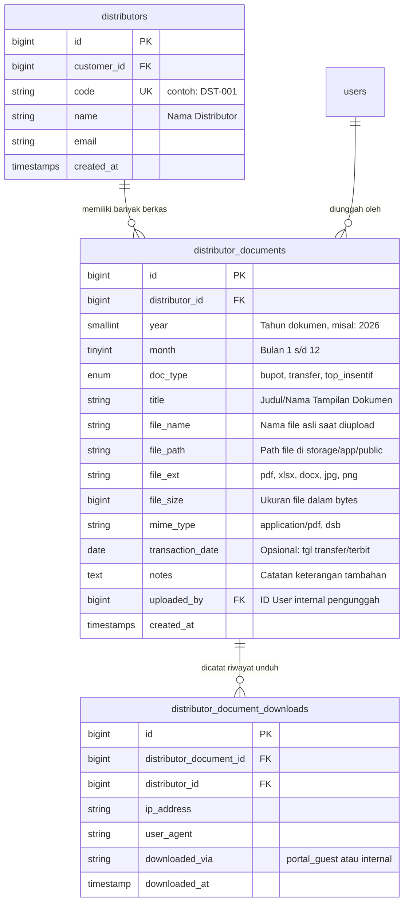

```mermaid
graph TD
    subgraph A["Sisi Internal (Finance Portal)"]
        A1[Menu: Dokumen Distributor] --> A2[Filter Tahun: misal 2026]
        A2 --> A3[Tabel List Distributor + Mini Badge Status 12 Bulan Jan-Des]
        A3 -->|Klik Baris / Kelola File| A4[Halaman Matrix 12 Bulan]
        A4 --> A5{Status Bulan}
        A5 -->|Sudah Ada File| A6[Tampil List File + Tombol Preview & Hapus]
        A5 -->|Belum Ada File| A7[Area Drag & Drop / Pilih File Kosong]
        A4 -->|Drop / Upload File| A8[Pilih Tipe: BuPot / Transfer / TOP Insentif]
        A8 --> A9[Simpan ke Storage & Catat di Database]
    end

    subgraph B["Sisi Eksternal (Halaman Login -> Tab BuPot)"]
        B1[Buka Halaman Login /login] --> B2[Klik Tab: Portal BuPot & Dokumen]
        B2 --> B3[Input: Kode Distributor + Tahun + Verifikasi 4 Digit NPWP]
        B3 --> B4{Validasi Cocok?}
        B4 -->|Tidak| B5[Tampilkan Pesan Error: Data Tidak Sesuai]
        B4 -->|Ya| B6[Tampilkan Dashboard Dokumen Tahun Terpilih]
        B6 --> B7[Navigasi Kategori: Tab Semua / BuPot / Transfer / Insentif]
        B6 --> B8[Aksi: Download File Satuan / Preview PDF / Download All .ZIP]
        B8 --> B9[Catat Log Unduhan di Audit Trail]
    end
```

<<<<<<< HEAD
# 📘 Analisis & Spesifikasi Implementasi Sistem Upload Dokumen Distributor

Dokumen ini berisi spesifikasi kebutuhan fungsional, alur pengguna (*User Flow*), rancangan antarmuka (*UI/UX Design*), rekomendasi skema basis data (*Database Schema*), serta arsitektur kode untuk fitur **Pengelolaan Dokumen Distributor (Bukti Potong, Penjelasan Transfer, dan TOP Insentif)** di sistem Finance.

---

## 📑 Daftar Isi
1. [Latar Belakang & Analisis Kebutuhan](#1-latar-belakang--analisis-kebutuhan)
2. [Arsitektur Alur & Interaksi Pengguna (User Flow)](#2-arsitektur-alur--interaksi-pengguna-user-flow)
   - [A. Sisi Internal Finance (Upload & Monitoring Matrix 12 Bulan)](#a-sisi-internal-finance-upload--monitoring-matrix-12-bulan)
   - [B. Sisi Eksternal Distributor (Portal BuPot Tanpa Login di Halaman Auth)](#b-sisi-eksternal-distributor-portal-bupot-tanpa-login-di-halaman-auth)
3. [Analisis Aturan Bisnis & Tipe Dokumen](#3-analisis-aturan-bisnis--tipe-dokumen)
4. [Rekomendasi Desain Antarmuka (UI/UX Mockup)](#4-rekomendasi-desain-antarmuka-uiux-mockup)
5. [Rekomendasi Skema Database (Database Design & Migrations)](#5-rekomendasi-skema-database-database-design--migrations)
6. [Rekomendasi Model Eloquent & Relasi Laravel](#6-rekomendasi-model-eloquent--relasi-laravel)
7. [Rancangan Routing & Controller](#7-rancangan-routing--controller)
8. [Keamanan & Audit Trail (Security & Compliance)](#8-keamanan--audit-trail-security--compliance)

---

## 1. Latar Belakang & Analisis Kebutuhan

Sistem ini memfasilitasi dua peran utama (*Dual Actors*):
1. **Tim Internal Finance / Tax / Sales Admin:**
   * Memilih Distributor dan Tahun Dokumen.
   * Mengelola dokumen dalam matriks 12 bulan (Januari s/d Desember).
   * Melakukan unggah berkas (drag-and-drop / file picker), pratinjau (*preview*), serta penghapusan/revisi berkas.
2. **Distributor (Akses Mandiri / Self-Service):**
   * Mengakses portal dokumen langsung dari halaman login utama melalui tab khusus **"Portal BuPot / Dokumen"**.
   * Tidak memerlukan login akun karyawan (NIK & Password), cukup dengan verifikasi kredensial distributor yang aman.
   * Mencari dokumen berdasarkan Tahun dan mengunduh berkas satuan maupun arsip tahunan (.ZIP).

---

## 2. Arsitektur Alur & Interaksi Pengguna (User Flow)



---

## 3. Analisis Aturan Bisnis & Klasifikasi Dokumen

Terdapat perbedaan mendasar antara dokumen **siklus kalender tahunan** versus dokumen **berjalan sepanjang masa kerjasama (*lifetime / multi-year running*)**:

| Tipe Dokumen | Lingkup (*Scope*) | Batasan Jumlah (*Cardinality*) | Karakteristik Bisnis & Penanganan Sistem |
| :--- | :---: | :---: | :--- |
| **Bukti Potong (BuPot)** | **Per Tahun & Per Bulan (Jan - Des)** | Multi-file (> 1 file per bulan) | Terikat masa pajak bulanan (Januari s/d Desember pada tahun yang dipilih). Distributor bisa memiliki beberapa bukti potong per masa (PPh 23, PPh 22, atau revisi/pembetulan). |
| **TOP Insentif** | **Per Tahun & Per Bulan (Jan - Des)** | Multi-file (> 1 file per bulan/periode) | Terikat periode tahun berjalan. Berisi memo persetujuan insentif, perhitungan target sales, atau persetujuan deviasi TOP per bulan/kuartal. |
| **Penjelasan Transfer** | **Per Distributor (Running Multi-Year / Sejak 2020 s/d Sekarang)** | Multi-file (Running terus tanpa batas tahun) | **TIDAK TERIKAT per tahun/bulan kalender.** Menjadi *repository* riwayat dokumen transfer distributor dari tahun-tahun terdahulu (misal: arsip sejak 2020) hingga transaksi transfer terkini. Selalu tampil utuh tanpa terpotong filter tahun aktif. |

---

## 4. Rekomendasi Desain Antarmuka (UI/UX Mockup)

### A. Tampilan List Index Distributor (Finance Admin)
Menggunakan **Smart Data Table** dengan visualisasi status 12 bulan (BuPot & TOP) serta badge jumlah berkas Transfer running:

```text
========================================================================================================
📋 MANAJEMEN DOKUMEN DISTRIBUTOR                              [ Filter Tahun: 2026 v ] [ + Upload Massal ]
========================================================================================================
Pencarian: [ Cari nama/kode distributor... ]
--------------------------------------------------------------------------------------------------------
KODE     | NAMA DISTRIBUTOR        | PROGRES BULANAN 2026 (JAN - DES)        | TRF RUNNING | AKSI
--------------------------------------------------------------------------------------------------------
DST-001  | PT Sinar Abadi Jaya     | [1][2][3][4][5][6][7][8][9][10][11][12] | 8 File      | [ 📂 Kelola File ]
         |                         |  🟩 🟩 🟩 🟩 🟨 ⬜ ⬜ ⬜ ⬜  ⬜  ⬜  ⬜   | (2020-2026) |
DST-002  | CV Maju Bersama         |  🟩 🟩 ⬜ ⬜ ⬜ ⬜ ⬜ ⬜ ⬜  ⬜  ⬜  ⬜   | 3 File      | [ 📂 Kelola File ]
DST-003  | PT Cahaya Distribusi    |  ⬜ ⬜ ⬜ ⬜ ⬜ ⬜ ⬜ ⬜ ⬜  ⬜  ⬜  ⬜   | 0 File      | [ 📂 Kelola File ]
--------------------------------------------------------------------------------------------------------
Keterangan Badge: 🟩 Lengkap (BuPot & TOP ada) | 🟨 Sebagian terisi | ⬜ Kosong (Belum ada dokumen)
```

---

### B. Tampilan Halaman Detail Distributor (Pemisahan Tab: Bulanan vs Transfer Running)
Halaman detail distributor dibagi menjadi 2 Tab Utama yang jelas:

```text
+----------------------------------------------------------------------------------------------------+
| 🏢 PT Sinar Abadi Jaya (DST-001)                                              [ 💾 Download All .ZIP ]
| NPWP: 01.234.567.8-901.000 | Email: finance@sinarabadi.co.id
+----------------------------------------------------------------------------------------------------+
|  [ TAB 1: Dokumen Bulanan (BuPot & TOP Insentif) ]  |  [ TAB 2: Penjelasan Transfer (Running) ]    |
+----------------------------------------------------------------------------------------------------+

=== JIKA MEMILIH TAB 1: DOKUMEN BULANAN ===
Filter Tahun: [ 2026 v ]

[ 📅 JANUARI 2026 ] 🟩 3 Dokumen                     [ 📅 FEBRUARI 2026 ] 🟨 1 Dokumen
+--------------------------------------------------+ +--------------------------------------------------+
| 🧾 Bukti Potong (2 File):                        | | 🧾 Bukti Potong (1 File):                        |
|   • Bupot_PPh23_Jan.pdf  (420 KB)                | |   • Bupot_PPh23_Feb.pdf (380 KB)                 |
|     [ 👁️ Preview ] [ ⬇️ Download ] [ 🗑️ Hapus ]     |     [ 👁️ Preview ] [ ⬇️ Download ] [ 🗑️ Hapus ]     |
|   • Bupot_PPN_Jan.pdf    (310 KB)                | |   [ + Tambah BuPot ]                             |
|     [ 👁️ Preview ] [ ⬇️ Download ] [ 🗑️ Hapus ]     | |                                                  |
|   [ + Tambah BuPot ]                             | | 🎯 TOP Insentif (0 File):                        |
|                                                  | |   +--------------------------------------------+ |
| 🎯 TOP Insentif (1 File):                        | |   | ☁️ Drag & drop file TOP Insentif Feb di sini| |
|   • Memo_Insentif_Jan.pdf [ 👁️ ] [ ⬇️ ] [ 🗑️ ]     | |   +--------------------------------------------+ |
|   [ + Tambah TOP Insentif ]                      | |                                                  |
+--------------------------------------------------+ +--------------------------------------------------+
| ... [ MARET s/d DESEMBER 2026 ]                  |                                                    |
+--------------------------------------------------+----------------------------------------------------+

=== JIKA MEMILIH TAB 2: PENJELASAN TRANSFER (RUNNING LINTAS TAHUN) ===
Daftar seluruh dokumen penjelasan transfer distributor ini (dari 2020 hingga sekarang):

[ + Upload File Transfer Baru ]  [ Pencarian / Filter Tahun: Semua Tahun v ]

--------------------------------------------------------------------------------------------------------
TGL / TAHUN  | NAMA FILE                  | KETERANGAN / CATATAN                   | UKURAN | AKSI
--------------------------------------------------------------------------------------------------------
15 Jan 2026  | Trf_Pelunasan_Jan2026.pdf  | Transfer pelunasan invoice INV-2026-01 | 350 KB | [👁️] [⬇️] [🗑️]
10 Nov 2025  | Rekap_Trf_Q4_2025.xlsx     | Rekonsiliasi transfer kuartal 4       | 1.2 MB | [👁️] [⬇️] [🗑️]
05 Mar 2023  | Penjelasan_Transfer_2023.pdf| Bukti transfer kompensasi retur       | 280 KB | [👁️] [⬇️] [🗑️]
12 Agu 2020  | Arsip_Trf_Awal_2020.pdf    | Dokumen transfer awal kerja sama      | 520 KB | [👁️] [⬇️] [🗑️]
--------------------------------------------------------------------------------------------------------
```

---

### C. Tampilan Tab Halaman Login (Publik untuk Distributor)
Distributor mengakses dokumen tanpa login internal karyawan:

```text
+---------------------------------------------------------------------------------+
|                           CUSTOMER PORTAL FINANCE                               |
+---------------------------------------------------------------------------------+
|  [ 👤 Login Karyawan (NIK) ]    |    [ 📜 Portal Dokumen Distributor (BuPot) ]  | <-- Aktif
+---------------------------------------------------------------------------------+
| Akses Mandiri Dokumen Pajak, Transfer & Insentif Distributor                   |
|                                                                                 |
| Kode Distributor *                                                              |
| [ DST-001                                                          ]            |
|                                                                                 |
| Verifikasi Keamanan: 4 Digit Terakhir NPWP Terdaftar *                          |
| [ 1000                                                             ]            |
| <small class="text-muted">Masukkan 4 digit terakhir nomor NPWP perusahaan Anda</small> |
|                                                                                 |
| [ 🔍 Akses Dokumen Saya ]                                                       |
+---------------------------------------------------------------------------------+

(Setelah Tombol Diklik dan Validasi Lolos - Tampil 2 Tab Navigasi Dokumen):
+---------------------------------------------------------------------------------+
| PT Sinar Abadi Jaya (DST-001)                          [ 📦 Download Semua ZIP ]|
|                                                                                 |
|  [ 🧾 Bukti Potong & TOP (Per Tahun) ]  |  [ 💸 Penjelasan Transfer (Running) ] |
|                                                                                 |
|  (Jika Tab 1 Aktif - Pilih Tahun: [ 2026 v ])                                   |
|   • Januari 2026:                                                               |
|     - Bukti Potong PPh 23 - Jan 2026.pdf (420 KB)    [ 👁️ Preview ] [ ⬇️ Unduh ]|
|     - Bukti Potong PPN - Jan 2026.pdf (310 KB)       [ 👁️ Preview ] [ ⬇️ Unduh ]|
|     - TOP Insentif Jan 2026.pdf (180 KB)             [ 👁️ Preview ] [ ⬇️ Unduh ]|
|                                                                                 |
|  (Jika Tab 2 Aktif - Menampilkan Semua Dokumen Transfer dari 2020 s/d Sekarang):|
|   • [2026] Transfer Pelunasan Jan 2026.pdf (350 KB)  [ 👁️ Preview ] [ ⬇️ Unduh ]|
|   • [2025] Rekap Transfer Q4 2025.xlsx (1.2 MB)      [ ⬇️ Unduh ]               |
|   • [2023] Penjelasan Transfer 2023.pdf (280 KB)     [ 👁️ Preview ] [ ⬇️ Unduh ]|
|   • [2020] Arsip Transfer Awal 2020.pdf (520 KB)     [ 👁️ Preview ] [ ⬇️ Unduh ]|
+---------------------------------------------------------------------------------+
```

---

## 5. Rekomendasi Skema Database (Database Design & Migrations)

### Diagram Relasi Entitas (ERD)



---

### Migration 1: `create_distributor_documents_table.php`

```php
<?php

use Illuminate\Database\Migrations\Migration;
use Illuminate\Database\Schema\Blueprint;
use Illuminate\Support\Facades\Schema;

return new class extends Migration
{
    public function up(): void
    {
        Schema::create('distributor_documents', function (Blueprint $table) {
            $table->id();
            $table->foreignId('distributor_id')->constrained('distributors')->cascadeOnDelete();
            
            // Periode Dokumen
            $table->unsignedSmallInteger('year')->index(); // Contoh: 2026
            $table->unsignedTinyInteger('month')->index(); // 1 = Januari, 12 = Desember
            
            // Klasifikasi Dokumen
            $table->enum('doc_type', ['bupot', 'transfer', 'top_insentif'])->index();
            
            // Detail Berkas
            $table->string('title')->nullable(); // Misal: "Bukti Potong PPh 23 Masa Jan"
            $table->string('file_name');         // Nama file asli
            $table->string('file_path');         // Path relatif di storage
            $table->string('file_ext', 20);      // pdf, xlsx, png, dll.
            $table->unsignedBigInteger('file_size')->default(0); // Dalam byte
            $table->string('mime_type', 100)->nullable();
            
            // Informasi Khusus Penjelasan Transfer & Catatan
            $table->date('transaction_date')->nullable(); // Tanggal transfer berjalan
            $table->text('notes')->nullable();            // Keterangan opsional
            
            // Audit Log Internal
            $table->foreignId('uploaded_by')->nullable()->constrained('users')->nullOnDelete();
            $table->timestamps();

            // Compound Index untuk Performa Query Cepat
            $table->index(['distributor_id', 'year', 'month'], 'dist_doc_period_idx');
            $table->index(['distributor_id', 'year', 'doc_type'], 'dist_doc_type_idx');
        });
    }

    public function down(): void
    {
        Schema::dropIfExists('distributor_documents');
    }
};
```

---

### Migration 2: `create_distributor_document_downloads_table.php` (Audit Log)

```php
<?php

use Illuminate\Database\Migrations\Migration;
use Illuminate\Database\Schema\Blueprint;
use Illuminate\Support\Facades\Schema;

return new class extends Migration
{
    public function up(): void
    {
        Schema::create('distributor_document_downloads', function (Blueprint $table) {
            $table->id();
            $table->foreignId('distributor_document_id')->constrained('distributor_documents')->cascadeOnDelete();
            $table->foreignId('distributor_id')->constrained('distributors')->cascadeOnDelete();
            $table->string('ip_address', 45)->nullable();
            $table->text('user_agent')->nullable();
            $table->enum('downloaded_via', ['guest_portal', 'internal'])->default('guest_portal');
            $table->timestamp('downloaded_at')->useCurrent();

            $table->index(['distributor_id', 'downloaded_at']);
        });
    }

    public function down(): void
    {
        Schema::dropIfExists('distributor_document_downloads');
    }
};
```

---

## 6. Rekomendasi Model Eloquent & Relasi Laravel

### Model: `App\Models\Customer\DistributorDocument.php`

```php
<?php

namespace App\Models\Customer;

use App\Models\User;
use Illuminate\Database\Eloquent\Factories\HasFactory;
use Illuminate\Database\Eloquent\Model;
use Illuminate\Support\Facades\Storage;

class DistributorDocument extends Model
{
    use HasFactory;

    protected $fillable = [
        'distributor_id',
        'year',
        'month',
        'doc_type',
        'title',
        'file_name',
        'file_path',
        'file_ext',
        'file_size',
        'mime_type',
        'transaction_date',
        'notes',
        'uploaded_by',
    ];

    protected $casts = [
        'year' => 'integer',
        'month' => 'integer',
        'transaction_date' => 'date',
        'file_size' => 'integer',
    ];

    protected $appends = ['file_url', 'human_file_size', 'type_label', 'month_name'];

    // Relasi ke Distributor
    public function distributor()
    {
        return $this->belongsTo(Distributor::class);
    }

    // Relasi ke User pengunggah
    public function uploader()
    {
        return $this->belongsTo(User::class, 'uploaded_by');
    }

    // Accessor: URL Berkas publik / stream
    public function getFileUrlAttribute(): string
    {
        return Storage::disk('public')->url($this->file_path);
    }

    // Accessor: Ukuran Berkas yang mudah dibaca (KB/MB)
    public function getHumanFileSizeAttribute(): string
    {
        $bytes = $this->file_size;
        if ($bytes >= 1048576) {
            return number_format($bytes / 1048576, 2) . ' MB';
        } elseif ($bytes >= 1024) {
            return number_format($bytes / 1024, 1) . ' KB';
        }
        return $bytes . ' B';
    }

    // Accessor: Label Tipe yang Manusiawi
    public function getTypeLabelAttribute(): string
    {
        return match ($this->doc_type) {
            'bupot' => 'Bukti Potong',
            'transfer' => 'Penjelasan Transfer',
            'top_insentif' => 'TOP Insentif',
            default => ucfirst($this->doc_type),
        };
    }

    // Accessor: Nama Bulan Bahasa Indonesia
    public function getMonthNameAttribute(): string
    {
        $months = [
            1 => 'Januari', 2 => 'Februari', 3 => 'Maret', 4 => 'April',
            5 => 'Mei', 6 => 'Juni', 7 => 'Juli', 8 => 'Agustus',
            9 => 'September', 10 => 'Oktober', 11 => 'November', 12 => 'Desember'
        ];
        return $months[$this->month] ?? "Bulan {$this->month}";
    }

    // Scope: Filter Berdasarkan Periode
    public function scopePeriod($query, int $year, ?int $month = null)
    {
        $query->where('year', $year);
        if ($month) {
            $query->where('month', $month);
        }
        return $query;
    }

    // Scope: Filter Tipe Dokumen
    public function scopeOfType($query, string $type)
    {
        return $query->where('doc_type', $type);
    }
}
```

---

### Update Relasi di `App\Models\Customer\Distributor.php`

Tambahkan relasi ke model `Distributor`:

```php
// Tambahkan di dalam App\Models\Customer\Distributor.php

public function documents()
{
    return $this->hasMany(DistributorDocument::class);
}

/**
 * Mendapatkan ringkasan status kelengkapan 12 bulan pada tahun tertentu
 * Mengembalikan array [1 => ['count' => 3, 'bupot' => 2, ...], ...]
 */
public function getMonthlyDocumentSummary(int $year): array
{
    $docs = $this->documents()->where('year', $year)->get();
    
    $summary = [];
    for ($m = 1; $m <= 12; $m++) {
        $monthDocs = $docs->where('month', $m);
        $summary[$m] = [
            'total' => $monthDocs->count(),
            'has_bupot' => $monthDocs->where('doc_type', 'bupot')->isNotEmpty(),
            'has_transfer' => $monthDocs->where('doc_type', 'transfer')->isNotEmpty(),
            'has_top_insentif' => $monthDocs->where('doc_type', 'top_insentif')->isNotEmpty(),
            'status' => $monthDocs->isEmpty() ? 'empty' : ($monthDocs->pluck('doc_type')->unique()->count() >= 3 ? 'complete' : 'partial'),
        ];
    }
    return $summary;
}
```

---

## 7. Rancangan Routing & Controller

### A. Rute Web (`routes/web.php`)

```php
// 1. RUTE PUBLIK (Tab BuPot di Halaman Login - Tanpa Auth Karyawan)
Route::prefix('portal-distributor')->name('portal.distributor.')->group(function () {
    Route::post('/search', [PublicDistributorDocumentController::class, 'searchDocuments'])->name('search');
    Route::get('/preview/{id}', [PublicDistributorDocumentController::class, 'previewFile'])->name('preview');
    Route::get('/download/{id}', [PublicDistributorDocumentController::class, 'downloadFile'])->name('download');
    Route::get('/download-all-zip', [PublicDistributorDocumentController::class, 'downloadAllZip'])->name('download.zip');
});

// 2. RUTE INTERNAL FINANCE (Wajib Login & Permission)
Route::middleware(['auth', 'verified'])->prefix('distributor-documents')->name('distributor.documents.')->group(function () {
    Route::get('/', [DistributorDocumentController::class, 'index'])->name('index');
    Route::get('/matrix/{distributorId}', [DistributorDocumentController::class, 'matrixView'])->name('matrix');
    Route::post('/upload', [DistributorDocumentController::class, 'storeUpload'])->name('upload');
    Route::delete('/{id}', [DistributorDocumentController::class, 'destroy'])->name('destroy');
    Route::get('/preview/{id}', [DistributorDocumentController::class, 'previewFile'])->name('preview');
});
```

---

## 8. Keamanan & Audit Trail (Security & Compliance)

1. **Pencegahan Data Leakage di Tab Portal Publik:**
   * Validasi wajib mencocokkan `code` distributor dan `npwp` (atau 4 digit terakhir NPWP dari tabel `customers`).
   * *Rate Limiting*: Batasi percobaan pencarian maksimal 5 kali per menit per IP untuk mencegah brute-force scanning kode distributor (`throttle:5,1`).
2. **Penyimpanan Berkas Terisolasi:**
   * Folder penyimpanan: `storage/app/public/distributor_docs/{year}/{distributor_code}/{month}/`.
   * Nama file di storage di-hash (*UUID / Timestamp*) untuk menghindari eksekusi script berbahaya dan penimpaan file nama kembar.
3. **Pencatatan Audit Trail:**
   * Setiap kali distributor mengunduh dokumen dari portal publik, sistem mencatat record di `distributor_document_downloads` (IP address, tanggal, user agent). Dokumen ini menjadi bukti resmi bagi Finance bahwa distributor telah menerima bukti potong pajaknya.

---
*Dokumen ini siap dijadikan acuan langsung untuk tahap eksekusi kode (migration, model, controller, dan tampilan blade).*
=======
# 📘 Analisis & Spesifikasi Implementasi Sistem Upload Dokumen Distributor

Dokumen ini berisi spesifikasi kebutuhan fungsional, alur pengguna (*User Flow*), rancangan antarmuka (*UI/UX Design*), rekomendasi skema basis data (*Database Schema*), serta arsitektur kode untuk fitur **Pengelolaan Dokumen Distributor (Bukti Potong, Penjelasan Transfer, dan TOP Insentif)** di sistem Finance.

---

## 📑 Daftar Isi
1. [Latar Belakang & Analisis Kebutuhan](#1-latar-belakang--analisis-kebutuhan)
2. [Arsitektur Alur & Interaksi Pengguna (User Flow)](#2-arsitektur-alur--interaksi-pengguna-user-flow)
   - [A. Sisi Internal Finance (Upload & Monitoring Matrix 12 Bulan)](#a-sisi-internal-finance-upload--monitoring-matrix-12-bulan)
   - [B. Sisi Eksternal Distributor (Portal BuPot Tanpa Login di Halaman Auth)](#b-sisi-eksternal-distributor-portal-bupot-tanpa-login-di-halaman-auth)
3. [Analisis Aturan Bisnis & Tipe Dokumen](#3-analisis-aturan-bisnis--tipe-dokumen)
4. [Rekomendasi Desain Antarmuka (UI/UX Mockup)](#4-rekomendasi-desain-antarmuka-uiux-mockup)
5. [Rekomendasi Skema Database (Database Design & Migrations)](#5-rekomendasi-skema-database-database-design--migrations)
6. [Rekomendasi Model Eloquent & Relasi Laravel](#6-rekomendasi-model-eloquent--relasi-laravel)
7. [Rancangan Routing & Controller](#7-rancangan-routing--controller)
8. [Keamanan & Audit Trail (Security & Compliance)](#8-keamanan--audit-trail-security--compliance)

---

## 1. Latar Belakang & Analisis Kebutuhan

Sistem ini memfasilitasi dua peran utama (*Dual Actors*):
1. **Tim Internal Finance / Tax / Sales Admin:**
   * Memilih Distributor dan Tahun Dokumen.
   * Mengelola dokumen dalam matriks 12 bulan (Januari s/d Desember).
   * Melakukan unggah berkas (drag-and-drop / file picker), pratinjau (*preview*), serta penghapusan/revisi berkas.
2. **Distributor (Akses Mandiri / Self-Service):**
   * Mengakses portal dokumen langsung dari halaman login utama melalui tab khusus **"Portal BuPot / Dokumen"**.
   * Tidak memerlukan login akun karyawan (NIK & Password), cukup dengan verifikasi kredensial distributor yang aman.
   * Mencari dokumen berdasarkan Tahun dan mengunduh berkas satuan maupun arsip tahunan (.ZIP).

---

## 2. Arsitektur Alur & Interaksi Pengguna (User Flow)


---

## 3. Analisis Aturan Bisnis & Tipe Dokumen

| Tipe Dokumen | Batasan Jumlah (*Cardinality*) | Karakteristik Bisnis & Penanganan Sistem |
| :--- | :---: | :--- |
| **Bukti Potong (BuPot)** | **Multi-file (> 1 file per bulan)** | Distributor bisa memiliki lebih dari 1 bukti potong dalam 1 masa pajak (misal: PPh 23 dari beberapa transaksi jasa, PPh 22, atau bukti potong pembetulan). Sistem harus menampung *array of files*. |
| **Penjelasan Transfer** | **Running Terus (Multi-transaksi)** | Dokumen transfer berjalan terus sepanjang tahun. Rekomendasi teknis: Setiap berkas transfer dicatat dengan tanggal transaksi/keterangan (misal: *"Transfer Pelunasan Invoice INV-01"* atau *"Transfer Insentif Batch 2"*), sehingga distributor dapat melacak riwayat pembayaran tanpa tertimpa. |
| **TOP Insentif** | **Multi-file (> 1 file per periode)** | Memo persetujuan insentif, perhitungan target sales, atau persetujuan deviasi TOP. Bisa diunggah per bulan/kuartal lebih dari 1 lampiran pendukung. |

---

## 4. Rekomendasi Desain Antarmuka (UI/UX Mockup)

### A. Tampilan List Index Distributor (Finance Admin)
Menggunakan **Smart Data Table** dengan visualisasi status 12 bulan:

```text
========================================================================================================
📋 MANAJEMEN DOKUMEN DISTRIBUTOR                              [ Filter Tahun: 2026 v ] [ + Upload Massal ]
========================================================================================================
Pencarian: [ Cari nama/kode distributor... ]
--------------------------------------------------------------------------------------------------------
KODE     | NAMA DISTRIBUTOR        | PROGRES BULANAN (JAN - DES)             | TOTAL FILE | AKSI
--------------------------------------------------------------------------------------------------------
DST-001  | PT Sinar Abadi Jaya     | [1][2][3][4][5][6][7][8][9][10][11][12] | 18 File    | [ 📂 Kelola File ]
         |                         |  🟩 🟩 🟩 🟩 🟨 ⬜ ⬜ ⬜ ⬜  ⬜  ⬜  ⬜   |            |
DST-002  | CV Maju Bersama         |  🟩 🟩 ⬜ ⬜ ⬜ ⬜ ⬜ ⬜ ⬜  ⬜  ⬜  ⬜   | 6 File     | [ 📂 Kelola File ]
DST-003  | PT Cahaya Distribusi    |  ⬜ ⬜ ⬜ ⬜ ⬜ ⬜ ⬜ ⬜ ⬜  ⬜  ⬜  ⬜   | 0 File     | [ 📂 Kelola File ]
--------------------------------------------------------------------------------------------------------
Keterangan Badge: 🟩 Lengkap (Semua tipe ada) | 🟨 Sebagian terisi | ⬜ Kosong (Belum ada dokumen)
```

---

### B. Tampilan Halaman Matrix 12 Bulan (Detail & Upload)
Menampilkan 12 grid cards (Januari s/d Desember) responsif 3-4 kolom:

```text
+----------------------------------------------------------------------------------------------------+
| 🏢 PT Sinar Abadi Jaya (DST-001)                     [ Pilih Tahun: 2026 v ]  [ 💾 Download All .ZIP ]
| NPWP: 01.234.567.8-901.000 | Email: finance@sinarabadi.co.id
+----------------------------------------------------------------------------------------------------+

[ 📅 JANUARI 2026 ] 🟩 4 Dokumen                     [ 📅 FEBRUARI 2026 ] 🟨 2 Dokumen
+--------------------------------------------------+ +--------------------------------------------------+
| 🧾 Bukti Potong (2 File):                        | | 🧾 Bukti Potong (1 File):                        |
|   • Bupot_PPh23_Jan.pdf  (420 KB)                | |   • Bupot_PPh23_Feb.pdf (380 KB)                 |
|     [ 👁️ Preview ] [ ⬇️ Download ] [ 🗑️ Hapus ]     |     [ 👁️ Preview ] [ ⬇️ Download ] [ 🗑️ Hapus ]     |
|   • Bupot_PPN_Jan.pdf    (310 KB)                | |   [ + Tambah BuPot Lainnya ]                         |
|     [ 👁️ Preview ] [ ⬇️ Download ] [ 🗑️ Hapus ]     | |                                                  |
|                                                  | | 💸 Penjelasan Transfer (1 File):                 |
| 💸 Penjelasan Transfer (1 File):                 | |   • Trf_BCA_10Feb.pdf  [ 👁️ ] [ ⬇️ ] [ 🗑️ ]         |
|   • Trf_BCA_15Jan.pdf    [ 👁️ Preview ] [ ⬇️ ] [ 🗑️ ] | |                                                  |
|                                                  | | 🎯 TOP Insentif (0 File):                        |
| 🎯 TOP Insentif (1 File):                        | |   +--------------------------------------------+ |
|   • Memo_Insentif_Jan.pdf [ 👁️ ] [ ⬇️ ] [ 🗑️ ]     | |   | ☁️ Drag & drop file TOP Insentif di sini   | |
|                                                  | |   +--------------------------------------------+ |
| [ + Tambah Dokumen Baru ]                        | | [ + Tambah Dokumen Baru ]                        |
+--------------------------------------------------+ +--------------------------------------------------+
```

---

### C. Tampilan Tab Halaman Login (Publik untuk Distributor)
Halaman `/login` ditambahkan komponen tab Bootstrap/Tailwind:

```text
+---------------------------------------------------------------------------------+
|                           CUSTOMER PORTAL FINANCE                               |
+---------------------------------------------------------------------------------+
|  [ 👤 Login Karyawan (NIK) ]    |    [ 📜 Portal Dokumen Distributor (BuPot) ]  | <-- Aktif
+---------------------------------------------------------------------------------+
| Akses Mandiri Dokumen Pajak, Transfer & Insentif Distributor                   |
|                                                                                 |
| Kode Distributor *                                                              |
| [ DST-001                                                          ]            |
|                                                                                 |
| Tahun Pajak / Dokumen *                                                         |
| [ 2026                                                           v ]            |
|                                                                                 |
| Verifikasi Keamanan: 4 Digit Terakhir NPWP Terdaftar *                          |
| [ 1000                                                             ]            |
| <small class="text-muted">Masukkan 4 digit terakhir nomor NPWP perusahaan Anda</small> |
|                                                                                 |
| [ 🔍 Cari & Tampilkan Dokumen ]                                                 |
+---------------------------------------------------------------------------------+

(Setelah Tombol Diklik dan Validasi Lolos - Hasil Ditampilkan Dinamis):
+---------------------------------------------------------------------------------+
| PT Sinar Abadi Jaya (Tahun 2026)                       [ 📦 Download Semua ZIP ]|
|                                                                                 |
|  [ Semua Dokumen (12) ]  [ 🧾 Bukti Potong (6) ]  [ 💸 Transfer (4) ]  [ 🎯 TOP ]|
|                                                                                 |
|  Bulan Januari 2026:                                                            |
|   • Bukti Potong PPh 23 - Januari 2026.pdf (420 KB)    [ 👁️ Preview ] [ ⬇️ Unduh ]|
|   • Bukti Potong PPN - Januari 2026.pdf (310 KB)       [ 👁️ Preview ] [ ⬇️ Unduh ]|
|   • Penjelasan Transfer Tgl 15 Jan.pdf (200 KB)        [ 👁️ Preview ] [ ⬇️ Unduh ]|
|                                                                                 |
|  Bulan Februari 2026:                                                           |
|   • Bukti Potong PPh 23 - Februari 2026.pdf (380 KB)   [ 👁️ Preview ] [ ⬇️ Unduh ]|
+---------------------------------------------------------------------------------+
```

---

## 5. Rekomendasi Skema Database (Database Design & Migrations)

### Diagram Relasi Entitas (ERD)


---

### Migration 1: `create_distributor_documents_table.php`

```php
<?php

use Illuminate\Database\Migrations\Migration;
use Illuminate\Database\Schema\Blueprint;
use Illuminate\Support\Facades\Schema;

return new class extends Migration
{
    public function up(): void
    {
        Schema::create('distributor_documents', function (Blueprint $table) {
            $table->id();
            $table->foreignId('distributor_id')->constrained('distributors')->cascadeOnDelete();
            
            // Periode Dokumen
            $table->unsignedSmallInteger('year')->index(); // Contoh: 2026
            $table->unsignedTinyInteger('month')->index(); // 1 = Januari, 12 = Desember
            
            // Klasifikasi Dokumen
            $table->enum('doc_type', ['bupot', 'transfer', 'top_insentif'])->index();
            
            // Detail Berkas
            $table->string('title')->nullable(); // Misal: "Bukti Potong PPh 23 Masa Jan"
            $table->string('file_name');         // Nama file asli
            $table->string('file_path');         // Path relatif di storage
            $table->string('file_ext', 20);      // pdf, xlsx, png, dll.
            $table->unsignedBigInteger('file_size')->default(0); // Dalam byte
            $table->string('mime_type', 100)->nullable();
            
            // Informasi Khusus Penjelasan Transfer & Catatan
            $table->date('transaction_date')->nullable(); // Tanggal transfer berjalan
            $table->text('notes')->nullable();            // Keterangan opsional
            
            // Audit Log Internal
            $table->foreignId('uploaded_by')->nullable()->constrained('users')->nullOnDelete();
            $table->timestamps();

            // Compound Index untuk Performa Query Cepat
            $table->index(['distributor_id', 'year', 'month'], 'dist_doc_period_idx');
            $table->index(['distributor_id', 'year', 'doc_type'], 'dist_doc_type_idx');
        });
    }

    public function down(): void
    {
        Schema::dropIfExists('distributor_documents');
    }
};
```

---

### Migration 2: `create_distributor_document_downloads_table.php` (Audit Log)

```php
<?php

use Illuminate\Database\Migrations\Migration;
use Illuminate\Database\Schema\Blueprint;
use Illuminate\Support\Facades\Schema;

return new class extends Migration
{
    public function up(): void
    {
        Schema::create('distributor_document_downloads', function (Blueprint $table) {
            $table->id();
            $table->foreignId('distributor_document_id')->constrained('distributor_documents')->cascadeOnDelete();
            $table->foreignId('distributor_id')->constrained('distributors')->cascadeOnDelete();
            $table->string('ip_address', 45)->nullable();
            $table->text('user_agent')->nullable();
            $table->enum('downloaded_via', ['guest_portal', 'internal'])->default('guest_portal');
            $table->timestamp('downloaded_at')->useCurrent();

            $table->index(['distributor_id', 'downloaded_at']);
        });
    }

    public function down(): void
    {
        Schema::dropIfExists('distributor_document_downloads');
    }
};
```

---

## 6. Rekomendasi Model Eloquent & Relasi Laravel

### Model: `App\Models\Customer\DistributorDocument.php`

```php
<?php

namespace App\Models\Customer;

use App\Models\User;
use Illuminate\Database\Eloquent\Factories\HasFactory;
use Illuminate\Database\Eloquent\Model;
use Illuminate\Support\Facades\Storage;

class DistributorDocument extends Model
{
    use HasFactory;

    protected $fillable = [
        'distributor_id',
        'year',
        'month',
        'doc_type',
        'title',
        'file_name',
        'file_path',
        'file_ext',
        'file_size',
        'mime_type',
        'transaction_date',
        'notes',
        'uploaded_by',
    ];

    protected $casts = [
        'year' => 'integer',
        'month' => 'integer',
        'transaction_date' => 'date',
        'file_size' => 'integer',
    ];

    protected $appends = ['file_url', 'human_file_size', 'type_label', 'month_name'];

    // Relasi ke Distributor
    public function distributor()
    {
        return $this->belongsTo(Distributor::class);
    }

    // Relasi ke User pengunggah
    public function uploader()
    {
        return $this->belongsTo(User::class, 'uploaded_by');
    }

    // Accessor: URL Berkas publik / stream
    public function getFileUrlAttribute(): string
    {
        return Storage::disk('public')->url($this->file_path);
    }

    // Accessor: Ukuran Berkas yang mudah dibaca (KB/MB)
    public function getHumanFileSizeAttribute(): string
    {
        $bytes = $this->file_size;
        if ($bytes >= 1048576) {
            return number_format($bytes / 1048576, 2) . ' MB';
        } elseif ($bytes >= 1024) {
            return number_format($bytes / 1024, 1) . ' KB';
        }
        return $bytes . ' B';
    }

    // Accessor: Label Tipe yang Manusiawi
    public function getTypeLabelAttribute(): string
    {
        return match ($this->doc_type) {
            'bupot' => 'Bukti Potong',
            'transfer' => 'Penjelasan Transfer',
            'top_insentif' => 'TOP Insentif',
            default => ucfirst($this->doc_type),
        };
    }

    // Accessor: Nama Bulan Bahasa Indonesia
    public function getMonthNameAttribute(): string
    {
        $months = [
            1 => 'Januari', 2 => 'Februari', 3 => 'Maret', 4 => 'April',
            5 => 'Mei', 6 => 'Juni', 7 => 'Juli', 8 => 'Agustus',
            9 => 'September', 10 => 'Oktober', 11 => 'November', 12 => 'Desember'
        ];
        return $months[$this->month] ?? "Bulan {$this->month}";
    }

    // Scope: Filter Berdasarkan Periode
    public function scopePeriod($query, int $year, ?int $month = null)
    {
        $query->where('year', $year);
        if ($month) {
            $query->where('month', $month);
        }
        return $query;
    }

    // Scope: Filter Tipe Dokumen
    public function scopeOfType($query, string $type)
    {
        return $query->where('doc_type', $type);
    }
}
```

---

### Update Relasi di `App\Models\Customer\Distributor.php`

Tambahkan relasi ke model `Distributor`:

```php
// Tambahkan di dalam App\Models\Customer\Distributor.php

public function documents()
{
    return $this->hasMany(DistributorDocument::class);
}

/**
 * Mendapatkan ringkasan status kelengkapan 12 bulan pada tahun tertentu
 * Mengembalikan array [1 => ['count' => 3, 'bupot' => 2, ...], ...]
 */
public function getMonthlyDocumentSummary(int $year): array
{
    $docs = $this->documents()->where('year', $year)->get();
    
    $summary = [];
    for ($m = 1; $m <= 12; $m++) {
        $monthDocs = $docs->where('month', $m);
        $summary[$m] = [
            'total' => $monthDocs->count(),
            'has_bupot' => $monthDocs->where('doc_type', 'bupot')->isNotEmpty(),
            'has_transfer' => $monthDocs->where('doc_type', 'transfer')->isNotEmpty(),
            'has_top_insentif' => $monthDocs->where('doc_type', 'top_insentif')->isNotEmpty(),
            'status' => $monthDocs->isEmpty() ? 'empty' : ($monthDocs->pluck('doc_type')->unique()->count() >= 3 ? 'complete' : 'partial'),
        ];
    }
    return $summary;
}
```

---

## 7. Rancangan Routing & Controller

### A. Rute Web (`routes/web.php`)

```php
// 1. RUTE PUBLIK (Tab BuPot di Halaman Login - Tanpa Auth Karyawan)
Route::prefix('portal-distributor')->name('portal.distributor.')->group(function () {
    Route::post('/search', [PublicDistributorDocumentController::class, 'searchDocuments'])->name('search');
    Route::get('/preview/{id}', [PublicDistributorDocumentController::class, 'previewFile'])->name('preview');
    Route::get('/download/{id}', [PublicDistributorDocumentController::class, 'downloadFile'])->name('download');
    Route::get('/download-all-zip', [PublicDistributorDocumentController::class, 'downloadAllZip'])->name('download.zip');
});

// 2. RUTE INTERNAL FINANCE (Wajib Login & Permission)
Route::middleware(['auth', 'verified'])->prefix('distributor-documents')->name('distributor.documents.')->group(function () {
    Route::get('/', [DistributorDocumentController::class, 'index'])->name('index');
    Route::get('/matrix/{distributorId}', [DistributorDocumentController::class, 'matrixView'])->name('matrix');
    Route::post('/upload', [DistributorDocumentController::class, 'storeUpload'])->name('upload');
    Route::delete('/{id}', [DistributorDocumentController::class, 'destroy'])->name('destroy');
    Route::get('/preview/{id}', [DistributorDocumentController::class, 'previewFile'])->name('preview');
});
```

---

## 8. Keamanan & Audit Trail (Security & Compliance)

1. **Pencegahan Data Leakage di Tab Portal Publik:**
   * Validasi wajib mencocokkan `code` distributor dan `npwp` (atau 4 digit terakhir NPWP dari tabel `customers`).
   * *Rate Limiting*: Batasi percobaan pencarian maksimal 5 kali per menit per IP untuk mencegah brute-force scanning kode distributor (`throttle:5,1`).
2. **Penyimpanan Berkas Terisolasi:**
   * Folder penyimpanan: `storage/app/public/distributor_docs/{year}/{distributor_code}/{month}/`.
   * Nama file di storage di-hash (*UUID / Timestamp*) untuk menghindari eksekusi script berbahaya dan penimpaan file nama kembar.
3. **Pencatatan Audit Trail:**
   * Setiap kali distributor mengunduh dokumen dari portal publik, sistem mencatat record di `distributor_document_downloads` (IP address, tanggal, user agent). Dokumen ini menjadi bukti resmi bagi Finance bahwa distributor telah menerima bukti potong pajaknya.

---
*Dokumen ini siap dijadikan acuan langsung untuk tahap eksekusi kode (migration, model, controller, dan tampilan blade).*
>>>>>>> d65454470d0e9e039ac6ddeddb6a14b5f41069cd
